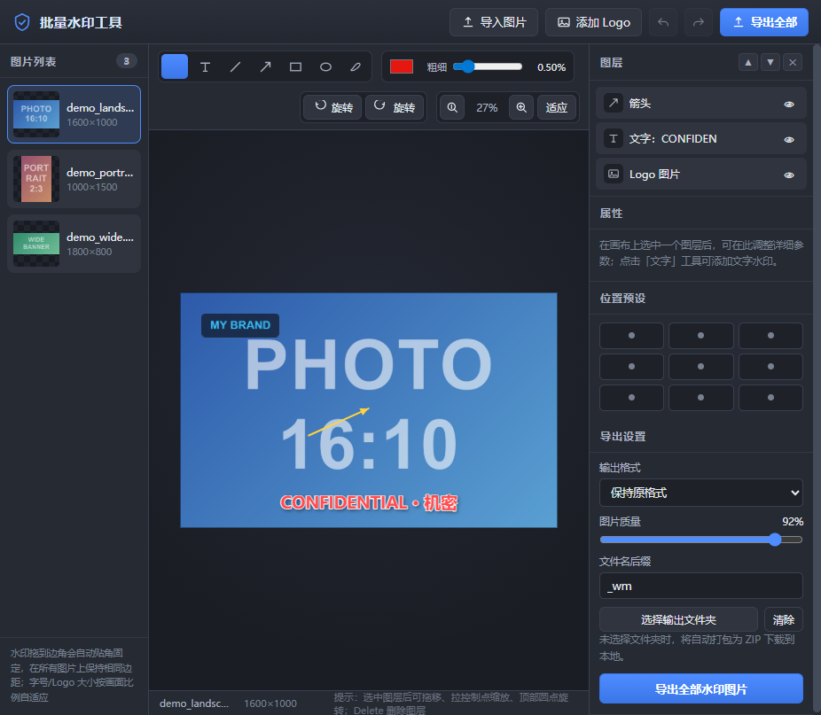

# 批量水印工具 · Batch Watermark

一款**纯前端、零安装、零依赖、图片不上传**的批量图片水印工具。双击 `index.html` 即可在浏览器中使用，所有处理均在本地完成。

支持不同格式、不同分辨率的图片批量加水印：文字 / Logo / 画线标注 / 涂鸦，水印可自由拖动、缩放、旋转，并能**贴角自动对齐**——在所有图片上保持相同的边角位置，最终统一导出到一个文件夹或一个 ZIP。



## 功能特性

- **批量导入**：拖入或点选多张图片，支持 JPG / PNG / WebP / BMP / GIF，自动识别 EXIF 方向，也支持 `Ctrl+V` 粘贴。
- **文字水印**：12 种字体、字号、加粗 / 斜体、多行文字、字间距、颜色与不透明度；支持**描边、阴影、底色标签**等效果。
- **Logo 水印**：添加透明 PNG 等图片 Logo，锁定宽高比自由缩放。
- **标注工具**：直线、箭头、矩形、椭圆、自由涂鸦，可调颜色和粗细。
- **自由变换**：拖移定位、8 个控制点缩放、顶部手柄旋转（按住 `Shift` 旋转以 15° 吸附、缩放等比）。
- **贴角自动对齐**：把水印拖到图片边角松手即自动“贴角固定”，在任意分辨率 / 横竖 / 宽高比的图片上都保持相同边距；拖离边角即可取消。也可使用九宫格位置预设。
- **跨图一致**：水印位置按相对坐标、大小按画面几何尺度（√宽×高）计算，不同分辨率图片效果统一，竖图不会缩成一团。
- **图片旋转**：每张图片可单独顺时针 / 逆时针旋转 90°，导出时按旋转后方向输出。
- **统一导出**：按**原始分辨率**逐张渲染，导出到所选文件夹；不支持文件夹选择时自动打包为一个 ZIP 下载。格式可选原格式 / JPEG / PNG / WebP，可调质量与文件名后缀。
- **撤销 / 重做**：完整操作历史，支持快捷键。
- **隐私安全**：无网络请求、无后端、无第三方库，图片永不离开本机。

## 快速开始

### 方式一：直接打开（最简单）

下载或克隆本仓库，双击根目录的 `index.html`，用 Chrome / Edge 打开即可使用。

### 方式二：本地服务器（推荐，支持直接导出到文件夹）

“选择输出文件夹直写”依赖 File System Access API，该 API 在部分浏览器中要求通过 `http(s)` 访问：

```bash
# 任选其一，在项目根目录启动静态服务器
python -m http.server 8000
npx serve .
```

然后浏览器访问 `http://localhost:8000`。

> 即使不启动服务器、直接双击打开，全部编辑功能也都可用，只是导出时会自动改为 **ZIP 打包下载**。

## 使用流程

1. 点击「导入图片」或直接把图片拖入窗口（左侧列表可切换预览）；
2. 用顶部工具栏添加**文字 / Logo / 直线 / 箭头 / 矩形 / 椭圆 / 涂鸦**；
3. 选中水印后拖动定位、拉控制点缩放、拖顶部圆点旋转；拖到边角可贴角固定；
4. 在右侧面板调整字体、颜色、描边、阴影、不透明度等属性；
5. 切换不同图片核对效果，确认后选择输出文件夹，点击「导出全部水印图片」。

## 快捷键

| 快捷键 | 功能 |
| --- | --- |
| `V` / `T` / `L` / `A` / `R` / `E` / `D` | 选择 / 文字 / 直线 / 箭头 / 矩形 / 椭圆 / 涂鸦 |
| `Delete` | 删除选中图层 |
| `Ctrl+Z` / `Ctrl+Y` | 撤销 / 重做 |
| 方向键（`Shift` 加速） | 微调选中图层位置 |
| `Esc` | 取消选择 |
| 滚轮 | 缩放画布 |

## 项目结构

```
.
├── index.html        # 页面结构（三栏布局）
├── css/
│   └── style.css     # 深色专业界面样式
├── js/
│   ├── app.js        # 全部核心逻辑：导入、画布引擎、交互、导出
│   └── zip.js        # 零依赖 ZIP 打包器（Store + CRC32，兜底导出）
└── docs/
    └── screenshot.jpg
```

## 浏览器兼容性

- 推荐使用最新版 **Chrome / Edge**（Chromium 内核）。
- “导出到文件夹”需要支持 File System Access API 的浏览器（Chrome、Edge 等）；
  Firefox / Safari 或 `file://` 方式打开时自动使用 ZIP 下载兜底。
- WebP 导出会自动检测当前浏览器是否支持，不支持时回退到 PNG / JPEG。

## 许可证

MIT
